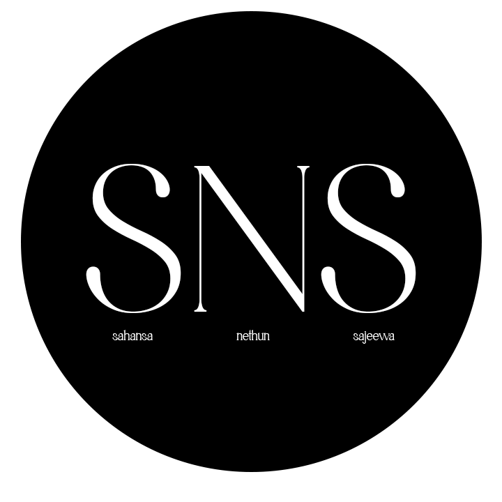

# GroupProject-SNS

  

<!-- ABOUT THE PROJECT -->

## About The Project

Project Idea: ‘NGram’  – The Student App for NSBM

Description: Building a Mobile Application        
Specially designed for NSBM Students.
This will innovate to create a new ‘Green Community’ while the users get the ability to use their university needs on their mobile phones.
Some of the main features are Faculty navigation, Lecture schedule/Hall Change pop-up notifications, Upcoming Green Events and Special Notice column to inform students.

<!-- CONTACT -->

## Contact

<table>

 <tr>
    <td>Sahansa Jayawardhana</td>
    <td><a href="https://twitter.com/sahansajay">Twitter</a> | <a href="https://www.instagram.com/seasonsixty/">Instagram</a> | <a href="mailto:methjaya252@gmail.com">Send a Mail</a></td>
  </tr>

  <tr>
    <td>Nethun Ranasingha</td>
    <td><a href="https://twitter.com/@Black_Demon223">Twitter</a> | <a href="https://www.instagram.com/nethun._.ranasinghe/">Instagram</a> | <a href="mailto:nethun223@gmail.com">Send a Mail</a></td>
  </tr>
   
 
  <tr>
    <td>Sajeewa Wijesinghe</td>
    <td><a href="">Twitter</a> | <a href="https://www.instagram.com/lsandmanl24/">Instagram</a> | <a href="mailto:Sajeewadw@gmail.com">Send a Mail</a></td>
  </tr>
  
</table>

(<a href="#top">back to top</a>)

